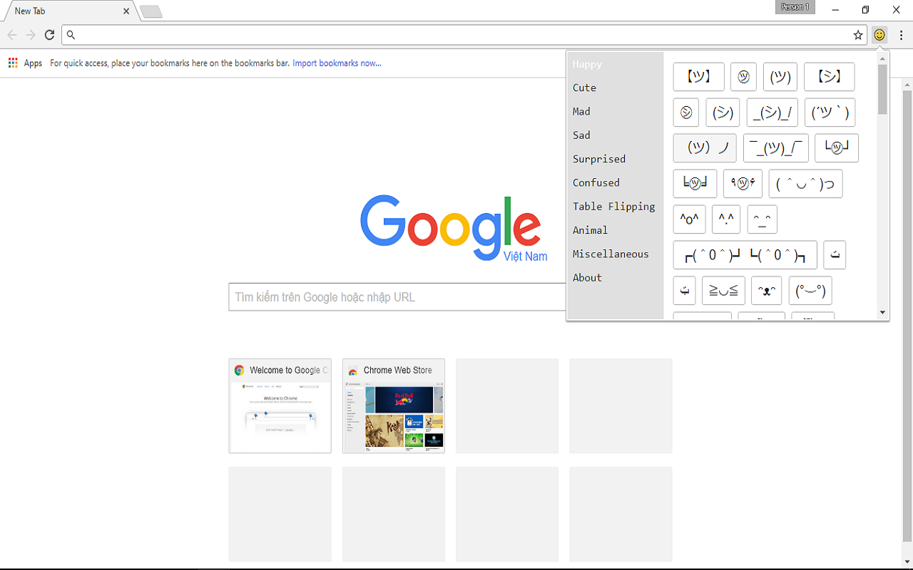
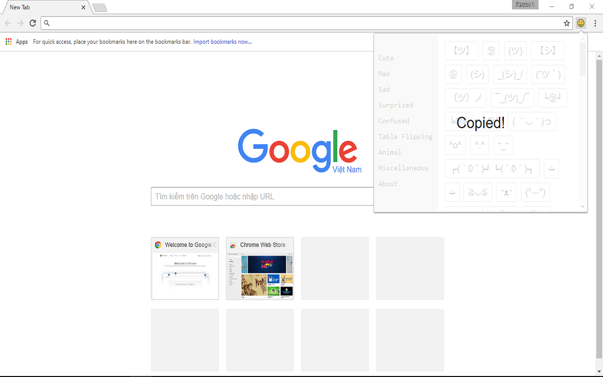

# Emojin

## Preview

## Install

Download at [here](build/emojin.crx)

Open Chrome. In search bar type `chrome://extensions/` then enter.

Drop file emojin which you downloaded to page. Then click `Add Extension`.

Video Tutorial

<iframe width="560" height="315" src="https://www.youtube.com/embed/wkR0oc-P_CA" frameborder="0" allowfullscreen></iframe>

## License

MIT